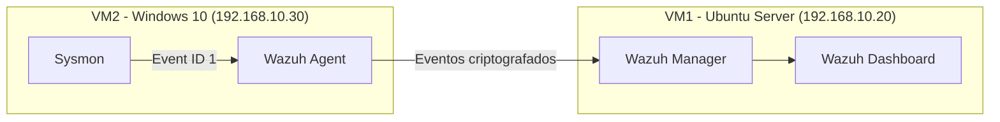
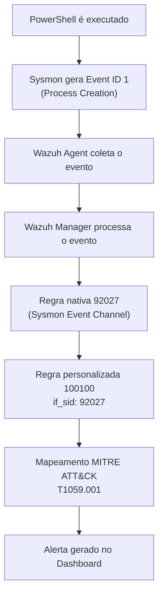

# wazuh-mitre-powershell-detection-lab
Laboratório de Detection Engineering com Wazuh e Sysmon para detecção de execução do PowerShell mapeada à técnica MITRE ATT&amp;CK T1059.001.
[README.md](https://github.com/user-attachments/files/30324754/README.md)
# 🛡️ MITRE ATT&CK Detection Engineering Lab with Wazuh + Sysmon

> Laboratório prático de Detection Engineering focado na criação de uma regra de detecção personalizada para identificar a execução do PowerShell, mapeada na técnica **T1059.001** do framework MITRE ATT&CK, utilizando **Wazuh** e **Sysmon** como stack de telemetria e SIEM.

<p align="left">
  
  
  
  
  
</p>

---

## 📑 Índice

- [Objetivos](#-objetivos)
- [Arquitetura do laboratório](#-arquitetura-do-laboratório)
- [Tecnologias utilizadas](#-tecnologias-utilizadas)
- [Topologia](#-topologia)
- [Fluxo da detecção](#-fluxo-da-detecção)
- [Instalação do ambiente](#-instalação-do-ambiente)
- [Instalação do Sysmon](#-instalação-do-sysmon)
- [Configuração do Wazuh](#-configuração-do-wazuh)
- [Integração Sysmon + Wazuh](#-integração-sysmon--wazuh)
- [Criação da regra personalizada](#-criação-da-regra-personalizada)
- [Explicação completa da regra XML](#-explicação-completa-da-regra-xml)
- [Como gerar o evento](#-como-gerar-o-evento)
- [Como validar a detecção](#-como-validar-a-detecção)
- [Resultado obtido](#-resultado-obtido)
- [Screenshots](#-screenshots)
- [Lições aprendidas](#-lições-aprendidas)
- [Competências demonstradas](#-competências-demonstradas)
- [Possíveis melhorias futuras](#-possíveis-melhorias-futuras)
- [Conclusão](#-conclusão)
- [Autor](#-autor)
- [Licença](#-licença)

---

## 🎯 Objetivos

Este projeto tem como propósito simular, de ponta a ponta, o trabalho de um **Detection Engineer** dentro de um SOC (Security Operations Center), cobrindo desde a implantação da telemetria até a validação de um alerta de segurança. Os objetivos específicos são:

- Implantar um ambiente de monitoramento composto por **Wazuh Manager**, **Wazuh Dashboard** e **Wazuh Agent**;
- Instalar e configurar o **Sysmon** em um host Windows para geração de telemetria de processos;
- Integrar os logs do Sysmon ao Wazuh via Windows Event Log;
- Desenvolver uma **regra de detecção personalizada** (`local_rules.xml`) capaz de identificar a execução do PowerShell;
- Mapear a detecção à técnica **T1059.001 — Command and Scripting Interpreter: PowerShell** do MITRE ATT&CK;
- Validar o funcionamento da regra através da geração controlada do evento e análise do alerta resultante.

> ⚠️ **Nota de escopo:** este laboratório **não utiliza malware**. Foi realizada apenas uma simulação segura e controlada da execução do PowerShell, com o objetivo exclusivo de validar a engenharia de detecção baseada em telemetria real do Sysmon.

---

## 🏗️ Arquitetura do laboratório

O ambiente foi construído em **Oracle VirtualBox**, com duas máquinas virtuais isoladas na mesma rede interna, simulando uma topologia típica de monitoramento corporativo (endpoint + servidor de SIEM).

| Máquina | Sistema Operacional | Endereço IP | Função |
|---|---|---|---|
| VM1 | Ubuntu Server | `192.168.10.20` | Wazuh Manager + Wazuh Dashboard |
| VM2 | Windows 10 | `192.168.10.30` | Wazuh Agent + Sysmon |

---

## 🧰 Tecnologias utilizadas

| Categoria | Ferramenta / Tecnologia |
|---|---|
| SIEM / XDR | Wazuh Manager 4.12 |
| Visualização | Wazuh Dashboard |
| Coleta de telemetria (endpoint) | Wazuh Agent |
| Instrumentação de processos | Microsoft Sysmon |
| Sistema operacional monitorado | Windows 10 |
| Sistema operacional do servidor | Ubuntu Server |
| Virtualização | Oracle VirtualBox |
| Linguagem de regras | XML |
| Framework de referência | MITRE ATT&CK |

---

## 🗺️ Topologia

<!-- Inserir imagem: Topologia -->



---

## 🔄 Fluxo da detecção

O diagrama abaixo representa o caminho completo de um evento, desde a execução do PowerShell no endpoint até a geração do alerta mapeado ao MITRE ATT&CK.



**Resumo textual do fluxo:**

1. O usuário (ou o analista, em modo de teste) executa o `powershell.exe` na VM2;
2. O **Sysmon** intercepta a criação do processo e gera o **Event ID 1**;
3. O **Wazuh Agent** coleta o evento do Windows Event Log e o envia de forma criptografada ao Manager;
4. O **Wazuh Manager** decodifica o evento e o casa com a **regra nativa 92027**, responsável por identificar eventos do canal do Sysmon;
5. A **regra personalizada 100100**, criada via herança (`if_sid`), é disparada especificamente para execuções de `powershell.exe`;
6. O alerta é enriquecido com o mapeamento **MITRE ATT&CK T1059.001** e exibido no **Wazuh Dashboard**.

---

## ⚙️ Instalação do ambiente

### Pré-requisitos

- Oracle VirtualBox instalado no host;
- Imagem ISO do Ubuntu Server;
- Imagem ISO ou VM do Windows 10;
- Rede interna (Internal Network / Host-Only) configurada entre as VMs;
- Conectividade validada via `ping` entre `192.168.10.20` e `192.168.10.30`.

### Instalação do Wazuh Manager (VM1 - Ubuntu Server)

```bash
curl -sO https://packages.wazuh.com/4.12/wazuh-install.sh
sudo bash wazuh-install.sh -a
```

> O script de instalação assistida (`-a`) provisiona automaticamente o **Wazuh Indexer**, o **Wazuh Manager** e o **Wazuh Dashboard**, gerando as credenciais de acesso ao final da instalação.

### Instalação do Wazuh Agent (VM2 - Windows 10)

```powershell
Invoke-WebRequest -Uri https://packages.wazuh.com/4.x/windows/wazuh-agent-4.12.0-1.msi -OutFile wazuh-agent.msi

msiexec.exe /i wazuh-agent.msi /q WAZUH_MANAGER="192.168.10.20"

NET START WazuhSvc
```

---

## 🧩 Instalação do Sysmon

O Sysmon (System Monitor) é um serviço da suíte **Sysinternals**, da Microsoft, que registra atividades detalhadas do sistema no Windows Event Log — muito além do que o log de eventos nativo do Windows oferece.

### Download e instalação

```powershell
Invoke-WebRequest -Uri https://download.sysinternals.com/files/Sysmon.zip -OutFile Sysmon.zip
Expand-Archive .\Sysmon.zip -DestinationPath .\Sysmon

# Instalação com uma configuração de referência (ex: sysmonconfig da comunidade)
.\Sysmon\Sysmon64.exe -accepteula -i sysmonconfig.xml
```

<!-- Inserir imagem: Sysmon instalado -->

Após a instalação, o Sysmon passa a registrar eventos no seguinte canal:

```
Applications and Services Logs > Microsoft > Windows > Sysmon > Operational
```

---

## 🖥️ Configuração do Wazuh

Após a instalação, o agente deve aparecer como **ativo** no Wazuh Dashboard, em `Agents management`.

<!-- Inserir imagem: Agente conectado -->

Validação via linha de comando no Manager:

```bash
/var/ossec/bin/agent_control -l
```

---

## 🔗 Integração Sysmon + Wazuh

Para que o Wazuh Agent colete os eventos do Sysmon, é necessário declarar o canal correspondente no arquivo de configuração do agente (`ossec.conf`), na VM2:

```xml
<localfile>
  <location>Microsoft-Windows-Sysmon/Operational</location>
  <log_format>eventchannel</log_format>
</localfile>
```

Após a alteração, o serviço do Wazuh Agent deve ser reiniciado:

```powershell
Restart-Service -Name WazuhSvc
```

<!-- Inserir imagem: Event Viewer -->

---

## 🧪 Criação da regra personalizada

Toda regra customizada no Wazuh deve residir no arquivo `local_rules.xml`, localizado em:

```
/var/ossec/etc/rules/local_rules.xml
```

### Regra criada

```xml
<group name="mitre_lab,powershell,">
  <rule id="100100" level="8">
    <if_sid>92027</if_sid>
    <field name="win.eventdata.image">powershell.exe</field>
    <description>MITRE LAB: PowerShell process execution detected</description>
    <mitre>
      <id>T1059.001</id>
    </mitre>
  </rule>
</group>
```

<!-- Inserir imagem: Regra XML -->

Após criar ou editar a regra, é necessário validar a sintaxe e reiniciar o Wazuh Manager:

```bash
/var/ossec/bin/wazuh-logtest
sudo systemctl restart wazuh-manager
```

---

## 📖 Explicação completa da regra XML

A tabela abaixo detalha, campo a campo, a lógica por trás da regra `100100`:

| Campo | Valor | Explicação |
|---|---|---|
| `rule id` | `100100` | Identificador único da regra. IDs a partir de `100000` são reservados para regras customizadas, evitando conflito com o ruleset nativo do Wazuh. |
| `level` | `8` | Nível de severidade do alerta (escala de 0 a 16). O nível 8 indica um evento relevante o suficiente para análise ativa, sem configurar uma severidade crítica. |
| `if_sid` | `92027` | Mecanismo de **herança de regras**. Indica que esta regra só é avaliada quando a regra de ID `92027` (regra nativa que identifica eventos do canal Sysmon) já tiver sido correspondida. |
| `field name="win.eventdata.image"` | `powershell.exe` | Filtro que restringe o disparo do alerta apenas a eventos cujo processo criado seja o `powershell.exe`. |
| `description` | `MITRE LAB: PowerShell process execution detected` | Texto descritivo exibido no alerta, facilitando a triagem por parte do analista. |
| `mitre > id` | `T1059.001` | Mapeamento direto à técnica do MITRE ATT&CK, enriquecendo o alerta com contexto de Threat Intelligence. |

### O que é `if_sid`?

O atributo `if_sid` implementa o conceito de **herança de regras (rule inheritance)** no Wazuh. Em vez de reescrever toda a lógica de decodificação de um evento do zero, uma regra filha "herda" a condição de disparo de uma regra pai — nesse caso, a regra `92027`, responsável por identificar genericamente eventos provenientes do canal Sysmon. Isso permite criar regras específicas e granulares (como detectar apenas `powershell.exe`) sem duplicar lógica de parsing.

### O que é o Rule ID?

É o identificador numérico único de cada regra dentro do Wazuh. A faixa de `100000` a `119999` é reservada pela própria documentação do Wazuh para uso em **regras locais e customizadas**, evitando sobreposição com o ruleset padrão mantido pela comunidade e pela Wazuh Inc.

### O que é o Level?

Representa a **severidade** do alerta, numa escala de 0 (informativo) a 16 (crítico). Esse valor influencia diretamente:

- A cor e destaque do alerta no Dashboard;
- O disparo (ou não) de notificações/integrações (e-mail, Slack, SOAR);
- A priorização durante a triagem em um SOC real.

### O que é o MITRE Mapping?

É o vínculo entre um alerta técnico e uma **técnica catalogada no MITRE ATT&CK**. Esse mapeamento transforma um simples log em **inteligência acionável**, permitindo correlacionar o evento com táticas (Tactics), técnicas (Techniques) e sub-técnicas (Sub-techniques) documentadas globalmente, além de habilitar dashboards de cobertura ATT&CK dentro do próprio Wazuh.

---

## ▶️ Como gerar o evento

Para validar a regra em um ambiente controlado, basta executar o interpretador do PowerShell na VM2 (Windows 10):

```powershell
powershell.exe
```

Essa simples execução é suficiente para que o Sysmon capture o **Event ID 1 (Process Creation)** e envie a telemetria correspondente ao Wazuh Agent.

---

## ✅ Como validar a detecção

1. Acesse o **Wazuh Dashboard** em `https://192.168.10.20`;
2. Navegue até o módulo **Security Events**;
3. Filtre por `rule.id: 100100` ou pela descrição `MITRE LAB: PowerShell process execution detected`;
4. Confirme que o alerta exibe o nível `8` e o mapeamento **T1059.001**.

<!-- Inserir imagem: Alerta 100100 -->

Validação adicional via linha de comando, diretamente no Manager, utilizando o `wazuh-logtest`:

```bash
/var/ossec/bin/wazuh-logtest
```

---

## 📊 Resultado obtido

> ✅ A execução do `powershell.exe` na VM2 foi detectada com sucesso pelo Wazuh, gerando um alerta de **nível 8**, corretamente mapeado à técnica **T1059.001 (Command and Scripting Interpreter: PowerShell)** do MITRE ATT&CK, e devidamente exibido no Wazuh Dashboard com todos os metadados de origem (host, usuário, linha de comando e processo pai).

---

## 🖼️ Screenshots

<!-- Inserir imagem: Dashboard -->

| Etapa | Descrição |
|---|---|
| Topologia | Visão geral da arquitetura do laboratório |
| Agente conectado | Status do Wazuh Agent no Dashboard |
| Sysmon instalado | Confirmação da instalação via terminal |
| Event Viewer | Evento Sysmon (ID 1) no Windows Event Log |
| Regra XML | Conteúdo do `local_rules.xml` |
| Alerta 100100 | Alerta gerado no Wazuh Dashboard |

---

## 📚 Lições aprendidas

- A importância da **herança de regras (`if_sid`)** para construir detecções granulares sem reescrever lógica de parsing já existente no ruleset nativo;
- Como a telemetria de processo do **Sysmon** é significativamente mais rica que o log de eventos padrão do Windows;
- A relevância de mapear alertas técnicos a um framework como o **MITRE ATT&CK**, transformando logs brutos em inteligência de ameaças estruturada;
- O fluxo real de dados em um SIEM, desde a geração do evento no endpoint até a correlação e exibição do alerta;
- Boas práticas de organização de IDs de regras customizadas para evitar conflitos com atualizações do ruleset oficial do Wazuh.

---

## 💡 Competências Demonstradas

✔ Detection Engineering
✔ Blue Team
✔ Threat Hunting
✔ Wazuh
✔ Sysmon
✔ MITRE ATT&CK
✔ XML Rules
✔ Event Analysis
✔ Windows Security
✔ SIEM
✔ Log Analysis
✔ Rule Development
✔ SOC Operations

---

## 🚀 Possíveis melhorias futuras

- [ ] Expandir a cobertura de detecção para outras sub-técnicas de `T1059` (ex: `cmd.exe`, `wscript.exe`);
- [ ] Adicionar correlação com linha de comando (`win.eventdata.commandLine`) para detectar padrões suspeitos de ofuscação;
- [ ] Criar regras adicionais para detectar **PowerShell Encoded Commands** (`-enc`, `-EncodedCommand`);
- [ ] Integrar o Wazuh a um SOAR para resposta automatizada a alertas de alta severidade;
- [ ] Adicionar testes automatizados de regressão para as regras customizadas;
- [ ] Expandir o laboratório com múltiplos endpoints para simular detecção em escala.

---

## 🏁 Conclusão

Este laboratório demonstra, na prática, o ciclo completo de trabalho de um **Detection Engineer**: da implantação da telemetria à criação e validação de uma regra de detecção customizada, com mapeamento direto ao **MITRE ATT&CK**. O projeto reforça competências essenciais para atuação em funções de **SOC Analyst**, **Blue Team** e **Detection Engineering**, evidenciando domínio técnico sobre Wazuh, Sysmon e engenharia de regras baseada em XML.

---

## 👤 Autor

**[Enzo Marin Perego]**
Analista de Segurança da Informação | Blue Team | Detection Engineering

[LinkedIn](#) • [GitHub](#) • [Portfólio](#)

---

## 📄 Licença

Este projeto está licenciado sob a licença **MIT** — sinta-se livre para utilizá-lo como referência de estudo ou base para seus próprios laboratórios.
