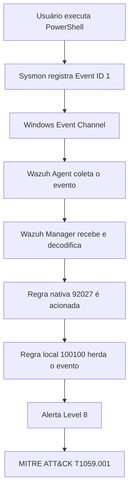

# Lógica da Detecção

## 1. Objetivo

A detecção foi desenvolvida para identificar execuções do PowerShell registradas pelo Microsoft Sysmon e processadas pelo Wazuh.

A regra personalizada adiciona contexto de Detection Engineering ao evento e realiza o mapeamento para a técnica MITRE ATT&CK:

```text
T1059.001 — PowerShell
```

---

## 2. Caso de uso

O PowerShell é uma ferramenta administrativa legítima presente em sistemas Windows.

Administradores e equipes de suporte podem utilizá-lo para:

- administração do sistema;
- automação;
- diagnóstico;
- instalação de componentes;
- gerenciamento de serviços;
- execução de scripts.

Entretanto, o PowerShell também pode ser utilizado por agentes de ameaça durante diferentes etapas de uma intrusão.

Por essa razão, a simples execução do PowerShell não confirma um incidente. O evento deve ser tratado como uma fonte de telemetria para investigação e correlação.

---

## 3. Fonte de dados

A principal fonte de dados é o Microsoft Sysmon.

Evento utilizado:

| Campo | Valor |
|---|---|
| Provedor | Microsoft Sysmon |
| Canal | `Microsoft-Windows-Sysmon/Operational` |
| Event ID | `1` |
| Categoria | Process Creation |

O Event ID 1 registra a criação de um novo processo.

Entre os campos potencialmente disponíveis estão:

- `Image`;
- `CommandLine`;
- `ParentImage`;
- `ParentCommandLine`;
- `User`;
- `ProcessId`;
- `ParentProcessId`;
- `UtcTime`;
- `Hashes`;
- `IntegrityLevel`.

---

## 4. Fluxo da detecção



---

## 5. Regra personalizada

```xml
<rule id="100100" level="8">
  <if_sid>92027</if_sid>

  <description>
    MITRE LAB: PowerShell process execution detected
  </description>

  <mitre>
    <id>T1059.001</id>
  </mitre>

  <group>
    execution,powershell_detection,mitre_t1059_001,
  </group>
</rule>
```

---

## 6. Explicação da regra

### 6.1 Rule ID

```xml
<rule id="100100" level="8">
```

O valor `100100` identifica de forma única a regra personalizada.

IDs locais devem ser organizados para evitar conflitos com regras nativas ou outras regras criadas no ambiente.

Neste laboratório, o ID foi utilizado exclusivamente para a detecção personalizada de PowerShell.

---

### 6.2 Level

```xml
level="8"
```

O nível representa a relevância atribuída ao alerta no Wazuh.

O nível 8 foi escolhido para tornar o evento visível durante o laboratório e facilitar sua investigação.

Esse nível não significa que toda execução do PowerShell seja maliciosa.

Em um ambiente corporativo, a severidade deve considerar:

- contexto do ativo;
- usuário responsável;
- linha de comando;
- processo pai;
- horário;
- frequência;
- criticidade do endpoint;
- presença de outros indicadores;
- comportamento histórico.

---

### 6.3 if_sid

```xml
<if_sid>92027</if_sid>
```

O elemento `if_sid` faz com que a regra personalizada dependa de uma regra anterior.

Neste caso, a regra `100100` somente será avaliada quando a regra `92027` tiver sido acionada.

Essa abordagem permite reutilizar a lógica de detecção e decodificação já existente.

Benefícios:

- evita duplicação de lógica;
- reduz a complexidade da regra local;
- aproveita o processamento nativo do Wazuh;
- facilita a manutenção;
- permite adicionar contexto específico ao laboratório.

Fluxo lógico:

```text
A regra 92027 reconhece o evento
                ↓
A regra 100100 adiciona contexto
                ↓
O alerta recebe o mapeamento MITRE
```

---

### 6.4 Description

```xml
<description>
  MITRE LAB: PowerShell process execution detected
</description>
```

A descrição informa ao analista qual comportamento foi detectado.

Uma boa descrição deve ser:

- objetiva;
- facilmente pesquisável;
- compreensível durante uma investigação;
- coerente com o comportamento observado.

---

### 6.5 MITRE Mapping

```xml
<mitre>
  <id>T1059.001</id>
</mitre>
```

Esse bloco relaciona o alerta à subtécnica MITRE ATT&CK `T1059.001`.

O mapeamento permite:

- organizar alertas por técnica;
- melhorar atividades de threat hunting;
- analisar cobertura de detecção;
- criar dashboards baseados no MITRE ATT&CK;
- relacionar eventos a comportamentos adversários conhecidos.

---

### 6.6 Groups

```xml
<group>
  execution,powershell_detection,mitre_t1059_001,
</group>
```

Os grupos funcionam como categorias adicionais para pesquisa e organização dos alertas.

Grupos utilizados:

| Grupo | Finalidade |
|---|---|
| `execution` | Classificar o evento na categoria de execução |
| `powershell_detection` | Identificar alertas relacionados ao PowerShell |
| `mitre_t1059_001` | Facilitar pesquisas pelo mapeamento MITRE |

---

## 7. Lógica de acionamento

A detecção segue a seguinte condição:

```text
SE
    um evento for reconhecido pela regra 92027
ENTÃO
    acionar a regra 100100
    definir o alerta como nível 8
    adicionar a descrição personalizada
    associar a técnica MITRE T1059.001
    adicionar grupos de pesquisa
```

---

## 8. Evento de teste

Foi utilizado um comando benigno:

```powershell
powershell.exe -NoProfile -Command "Write-Output 'MITRE T1059.001 Detection Test'"
```

A execução gera um novo processo do PowerShell.

O Sysmon registra o processo como Event ID 1 e o Wazuh processa a telemetria.

---

## 9. Resultado esperado

O alerta deve apresentar:

```text
Rule ID: 100100
Level: 8
Description: MITRE LAB: PowerShell process execution detected
MITRE ID: T1059.001
```

Consulta sugerida:

```text
rule.id: 100100
```

Consulta alternativa:

```text
rule.mitre.id: T1059.001
```

---

## 10. Limitações

A regra detecta a execução do PowerShell, mas não determina automaticamente se a atividade é maliciosa.

Possíveis fontes de falsos positivos:

- administradores de sistemas;
- ferramentas de gerenciamento;
- scripts de login;
- softwares corporativos;
- soluções de inventário;
- rotinas de backup;
- ferramentas de suporte;
- automações autorizadas.

A detecção deve ser enriquecida com contexto.

---

## 11. Campos importantes para investigação

Durante a análise, o analista deve revisar:

| Campo | Objetivo |
|---|---|
| `Image` | Confirmar o executável iniciado |
| `CommandLine` | Avaliar os parâmetros utilizados |
| `ParentImage` | Identificar o processo responsável |
| `ParentCommandLine` | Entender o contexto de execução |
| `User` | Identificar a conta utilizada |
| `UtcTime` | Construir a timeline |
| `Hashes` | Apoiar análise de reputação |
| `IntegrityLevel` | Avaliar privilégios do processo |
| Host | Identificar o endpoint envolvido |

---

## 12. Exemplos de sinais para investigação adicional

Alguns comportamentos podem aumentar a prioridade do evento:

```text
-EncodedCommand
-ExecutionPolicy Bypass
-WindowStyle Hidden
-NoProfile
DownloadString
Invoke-Expression
IEX
WebClient
Invoke-WebRequest
FromBase64String
```

A presença de um desses termos não confirma atividade maliciosa, mas pode justificar investigação adicional.

---

## 13. Possíveis melhorias

A detecção pode evoluir com condições adicionais, como:

- análise da linha de comando;
- identificação de comandos codificados;
- PowerShell iniciado por aplicações incomuns;
- correlação com conexões de rede;
- exclusão de contas administrativas autorizadas;
- allowlist de scripts conhecidos;
- correlação com alteração de arquivos;
- detecção de processos filhos;
- uso de PowerShell Script Block Logging;
- integração com inteligência de ameaças.

---

## 14. Estratégia recomendada para produção

Em ambiente corporativo, recomenda-se separar as detecções em diferentes níveis.

### Detecção de baixa severidade

Qualquer execução do PowerShell.

Objetivo:

- telemetria;
- baseline;
- hunting;
- análise comportamental.

### Detecção de média severidade

PowerShell com argumentos incomuns.

Exemplos:

- execução oculta;
- bypass de política;
- download de conteúdo;
- comandos codificados.

### Detecção de alta severidade

PowerShell correlacionado com outros comportamentos.

Exemplos:

- criação de persistência;
- conexão com domínio malicioso;
- execução por processo incomum;
- download e execução;
- movimentação lateral;
- alteração de ferramentas de segurança.

---

## 15. Conclusão

A regra `100100` demonstrou o uso de uma regra local do Wazuh para enriquecer uma detecção existente.

A lógica baseada em `if_sid` permitiu reutilizar a regra nativa `92027` e associar o evento à técnica MITRE ATT&CK `T1059.001`.

O resultado representa uma detecção inicial de telemetria. A classificação final depende da investigação do contexto, da linha de comando, do usuário, do processo pai e de eventos relacionados.
